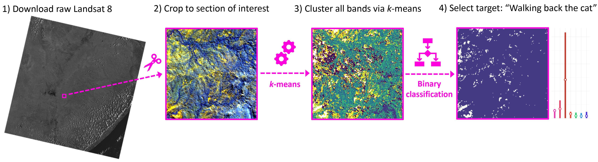
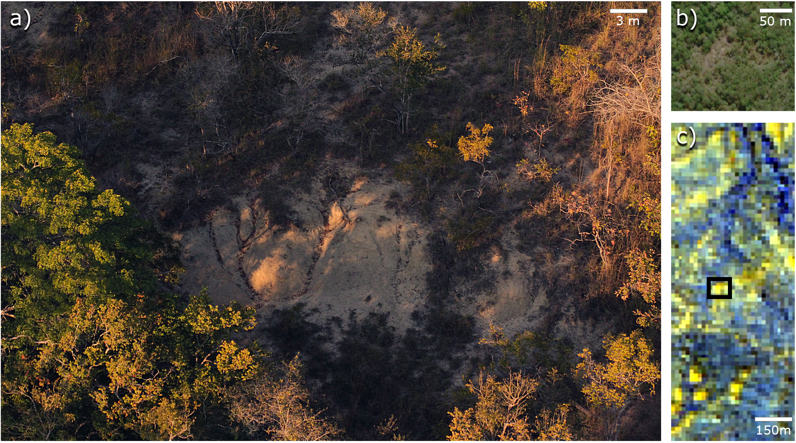
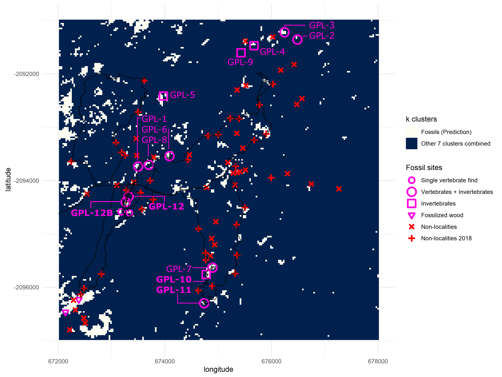

# kmeansGorongosa
Feature extraction for finding fossiliferous deposits in the lower Mazamba formation.

~

**Flowchart of the algorithmic pipeline used for remote fossil site detection.**

1) Example of one of the seven spectral bands satellite images used in this study;
2) False colour map based on the infrared bands, after cropping to study area;
3) Results of clustering using all seven spectral bands;
4) Binarize clusters for classification by selecting the cluster that contains most fossil sites as the target class (“walking back the cat”) versus all other clusters combined into a single class.

Use `<main.R>` for running the core of the protocol, which includes:

+ kmeans clustering
+ helper file for figure 1 barplot and map of Africa
+ binarized version of the kmeans output (cluster 1 vs all the other clusters)
+ variable importance (randomForest) 
+ visualizations for all graphics

**The miombo woodland and the challenges it presents to fossil prospecting:**

a) GPL-1 outcrops, notice how the surrounding vegetation is far more dense and extensive than in typical fossil sites from the EARS;
b) GPL-1 in high-resolution satellite image, extracted from bing.com, shows a reduction of vegetation, but outcrops are barely noticeable;
c) GPL-1, in a black rectangle, appears brighter than surrounding areas, when being mapped by lower resolution Landsat 8 false colour (infrared) image, and the same happens with other fossil sites, suggesting that infrared bands might be a useful indicator of fossiliferous deposits.

~~ Final model for Gorongosa + all known fossil localities as of 2021 ~~

**Binarized classification plotting cluster 1 versus all other clusters.**

New fossil sites GPL-10, 11, 12 and 12B are documented here for the first time. Trackways of surveys during 2018 are drawn in black. Clusters 2-8 are merged into a single cluster and compared against cluster 1 (predictive cluster). Total area = 36 km2. One grid square = 1 km2. One pixel-cell = 900 m2.